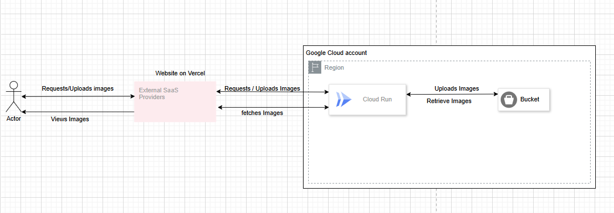

Overview: The project allows users to upload images and view them in a realistic and dynamic picture book. The key features are:
    1. Dynamic Page Updates: The number of pages are automatically updated as the user uploads new images
    2. Real Time Updates: New Images are instantly displayed without the need to refresh the page.
    3. Realistic Animations: Includes a flipping animation to mimic the look and feel of a real book.
Users are able to upload new images directly to the book which are securely stored and instantly displayed on the book.

Technologies Used:
    Frontend:
        Frontend was built using ReactTS/TailwindCSS & GraphQL as well as hosted on Vercel
    Backend:
        Backend is built using FastAPI and GraphQL and hosted on GCP. 
        The backend was hosted on GCP using Google Cloud Run and the images are stored in Google Cloud Buckets. Additionally the use of docker was used to facilitate and deploy the backend on GCP.

Overall Flow:
When a user accesses the webpage. Any images previously uploaded are first fetched and shown in the picture book.
When a user uploads another image - the image is sent to the backend by invoking a mutation. The mutation, upon success, invokes a refetchQueries which invokes a fetch mutation to get the latest images that are in the storage. Once the image is received by the backend, the backend uploads it to the google cloud bucket. Additionally the image url is also receieved after uploading it and then the url appended to a global array on the backend. After uploading is complete the fetch images mutation is invoked which gets all the urls from the backend and sends it to the frontend which is used to display and update the number of pages required for the picture book.

Architecture
## Architecture Diagram
